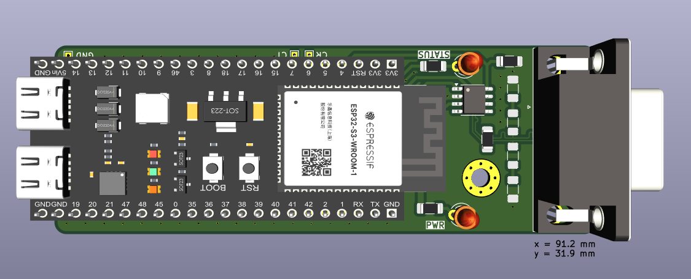

# CAN-DAQ based on the ESP32-S3 Microcontroller
This project is meant to help visualize messages on a CAN bus, with an affordable and open-source solution. We provide the design and firmware files for an affordable hardware solution (we were able to manufacture it for less than INR 2000).

Key features:
-   Support for CAN 2.0 up to **1 Mbps**.
-   Support for both standard and extended CAN frames.
-   Works with a maximum **sampling rate of 1 kHz**, which is sufficient for many applications.
-   USB interface for easy connection to a computer.
-   Accepts a standardized **CAN database file (DBC)** to interpret the messages on the CAN bus.
-   Real-time plotting of CAN messages.
-   Logging to an SQLite database for later analysis, with the ability to export to CSV.

## Usage
Please see the README files in each folder of this repository for detailed instructions on how to use the hardware and software.

Please see the [manual](docs/manual/manual.md) for further guidance.

## Overall architecture

Our hardware uses an [ESP32-S3](https://www.espressif.com/en/products/socs/esp32-s3) microcontroller and an [MCP2561](https://www.microchip.com/en-us/product/mcp2561) CAN transceiver to communicate with the CAN bus. We use the on-board USB-to-UART converter to communicate with the computer.

The firmware is written in C++ using the [ESP-IDF](https://www.espressif.com/en/products/sdks/esp-idf) framework, and is provided as open-source [software in this repository](can-daq-idf/).

The GUI software is written in Python using the [Tkinter](https://docs.python.org/3/library/tkinter.html) library and [matplotlib](https://matplotlib.org/) for plotting. We use [cantools](https://github.com/cantools/cantools/tree/master) to parse the CAN messages. The GUI software is also provided as open-source [software in this repository](can-daq-pc/).

It is expected that the user provides the [CAN database file (DBC)](https://www.csselectronics.com/pages/can-dbc-file-database-intro) to tell our software how to interpret the messages on the CAN bus.

# Design considerations

## ESP32 Microcontroller
We chose to use an ESP32-S3 microcontroller for the following reasons:
-   It is a current model and is not EOL (unlike the more popular ESP32-WROOM32).
-   It has a USB-OTG port, which allows for future upgrades, including the possibility of getting higher data rates.
-   The availability of Wi-Fi and Bluetooth allows for the possibility of re-building this as a wireless device.

### Evaluating other options
-   A development board is being used to accelerate prototyping and ensure reliability, instead of soldering the microcontroller module directly onto a PCB.
-   A choice needs to be made between the ESP32-WROOM32 and the ESP32-S2 (or ESP32-S3). S2 and S3 are newer and have more features and are not EOL.
-   Up till WROOM32, the "CAN" protocol is indeed called "CAN" in the datasheet. However, for S2 and S3, it is called "TWAI" (Two-Wire Automotive Interface). Reasons seem to be legal mostly \[[source](https://github.com/espressif/esp-idf/issues/5580)\], however it is possible for Espresiff to **change specifications** in the future since TWAI is not a standard name.
-   All three boards have native support for something equivalent to CAN 2.0, with extended frames. None have CAN-FD support.
-   All three boards support at least 2 UARTs.

**[ESP32-S3 DevKitC 1](https://docs.espressif.com/projects/esp-idf/en/latest/esp32s3/hw-reference/esp32s3/user-guide-devkitc-1.html) was chosen.** The additional USB-OTG port allows us the possibility of upgrades later down the line.

Datasheets:
-   [ESP32-WROOM32](https://www.espressif.com/sites/default/files/documentation/esp32-wroom-32_datasheet_en.pdf)
-   [ESP32-S2](https://www.espressif.com/sites/default/files/documentation/esp32-s2_datasheet_en.pdf)
-   [ESP32-S3](https://www.espressif.com/sites/default/files/documentation/esp32-s3_datasheet_en.pdf)

## CAN Transceiver
Let us first review the status, features, and drawbacks of each transceiver we considered.

| Part | Status | Fastest CAN version | Cross-compatible footprint |
| --- | --- | --- | --- |
| MCP2551 | EOL (end of life) | CAN 2.0 classic CAN | None |
| MCP2561 | EOL (end of life) | CAN 2.0 classic CAN | with MCP2561FD |
| MCP2561FD | Active | CAN FD | with MCP2561 |

Most of our testing was done with the MCP2551, which cannot be considered for new designs. We wanted to choose the MCP2561FD, however it is often not in stock. Finally, the MCP2561 is a good compromise, as it is still in stock and can be replaced by the MCP2561FD in the future.

**MCP2561 was chosen, with the possibility of upgrading to MCP2561FD in the future.**

Datasheets:
-   [MCP2551](https://ww1.microchip.com/downloads/aemDocuments/documents/APID/ProductDocuments/DataSheets/20001667G.pdf)
-   [MCP2561](https://ww1.microchip.com/downloads/en/devicedoc/20005167c.pdf)
-   [MCP2561FD](https://ww1.microchip.com/downloads/aemDocuments/documents/OTH/ProductDocuments/DataSheets/20005284A.pdf)

Migration guide:
-   [MCP2561FD Migration Guide](https://ww1.microchip.com/downloads/en/DeviceDoc/90003101A.pdf)

### Additional considerations
-   SELECT already has tested the MCP2551 and a PCB implementation. However, it is EOL and the recommended replacement is the MCP2561FD.
-   MCP2551 has 3 modes selectable by the `Rs` pin (normal, standby, internal slope control), and the MCP2561FD has 2 modes only (normal, standby).
-   According to the "migration guide" from Microchip, the MCP2561FD is otherwise a drop-in replacement for the MCP2551.

## USB-to-UART Converter
-   A choice needs to be made between using UART0 (built-in) or UART1 (external).
-   Common choices for USB-to-UART converters: [FTDI](https://www.ftdichip.com/Products/ICs/FT232R.htm), [CP2102N](https://www.silabs.com/interface/usb-bridges/usbxpress), [CH340](https://www.wch-ic.com/products/CH340.html).
-   If the problem with UART0 is debug output, this can be turned off by pulling GPIO15 to GND during boot and setting the appropriate flags in `menuconfig` of IDF.

**Internal UART0 was chosen for now.** This to ensure we can quickly develop the device without introducing additional complications.

Datasheets:
-   [CP2102N](https://www.silabs.com/documents/public/data-sheets/cp2102n-datasheet.pdf)

## GUI framework
For real-time plotting, a fast framework like [PyQtGraph](https://www.pyqtgraph.org/) and [PyQt](https://www.riverbankcomputing.com/static/Docs/PyQt6/) is recommended. However, we chose to use [matplotlib](https://matplotlib.org/) and [Tkinter](https://docs.python.org/3/library/tkinter.html) for the GUI software. This is because it is easier to use and has a lower learning curve.

We will consider using PyQtGraph and PyQt in the future if we need to increase the sampling rate.

## Logging database
We chose to use an [SQLite](https://www.sqlite.org/) database for logging. This allows us to use the [Python standard library](https://docs.python.org/3/library/sqlite3.html) to interact with the database. Moreover, the database exists as a file, which means our users do not need to install a database server.