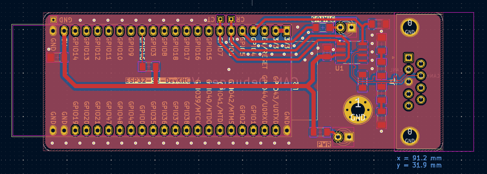
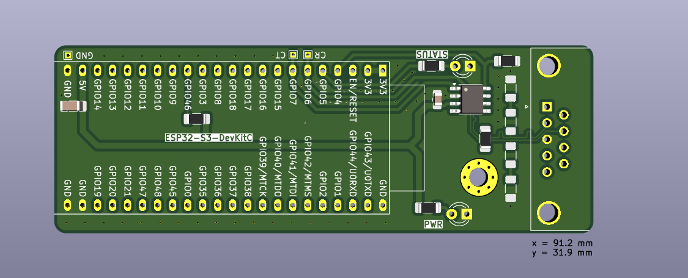

# CAN-DAQ ESP32 PCB

This is the PCB for the ESP32 that is used in the CAN-DAQ project. Gerber files, BOM, and 3D printing files for the case are all available in the releases section on GitHub.

## Pin-out
Refer to the pin-out for [ESP32-S3 DevKitC 1](https://docs.espressif.com/projects/esp-idf/en/latest/esp32s3/hw-reference/esp32s3/user-guide-devkitc-1.html).

### Pin-out for the microcontroller

| ESP Pin | Function | Connected to |
| --- | --- | --- |
| GPIO6 | CAN Rx | MCP2651FD CAN Rx |
| GPIO7 | CAN Tx | MCP2651FD CAN Tx |
| GPIO4 | CAN Standby | MCP2651FD STBY (10k pull-down) |
| GPIO5 | Status | Status LED |
| GPIO46 | Disable debug log | Pull-up resistor (10k to 5V) |

### Pin-out for the DE9 CAN connector
| DE9 Pin | Function | Connected to |
| --- | --- | --- |
| 2 | CANL | MCP2651FD CANL |
| 7 | CANH | MCP2651FD CANH |
| 3 | CAN GND | GND |
| shield |  | GND |

## USB specification
| Property | Value |
| --- | --- |
| USB standard | USB 2.0 |
| Connector | USB micro-B |
| Maximum speed | 3 Mbit/s |

## Design decisions

### DE9 ground
The CAN ground of the DE9 connector is connected to the main ground of the circuit. In case the differential voltages are not referenced to the same ground, the CAN bus will not work properly otherwise.

Sources:
- https://electronics.stackexchange.com/a/519395/323565
- https://electronics.stackexchange.com/q/476129/323565

### ESP32 log output disable
The ESP32 has a pull-up resistor on GPIO46 to disable the debug log output. We do this to make ensure that our GUI software receives only clean data.

Source: [Section "8.3 ROM Messages Printing Control" of the ESP32-S3 Technical Reference Manual](https://www.espressif.com/sites/default/files/documentation/esp32-s3_technical_reference_manual_en.pdf)

### CAN Transceiver output enable
The MCP2651FD CAN transceiver has a STBY pin that can be used to enable or disable the transceiver. We use GPIO4 to control this pin. The STBY pin is pulled down to ground with a 10k resistor (enabled) by default.

Source: [Section "1.1 Mode Control Block" of the MCP2651FD datasheet](https://ww1.microchip.com/downloads/en/DeviceDoc/20005284A.pdf)

## Screenshots

