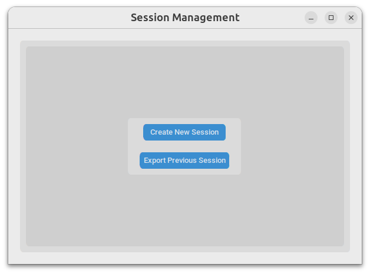
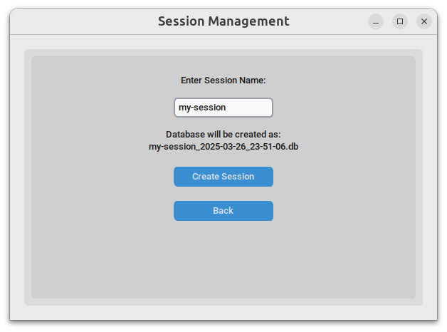
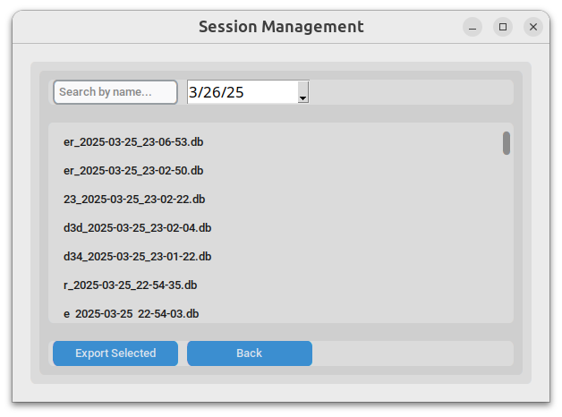
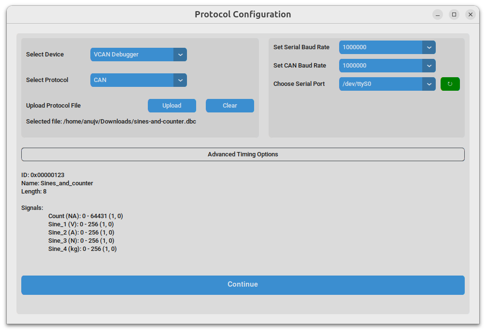
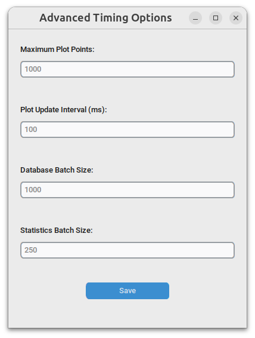
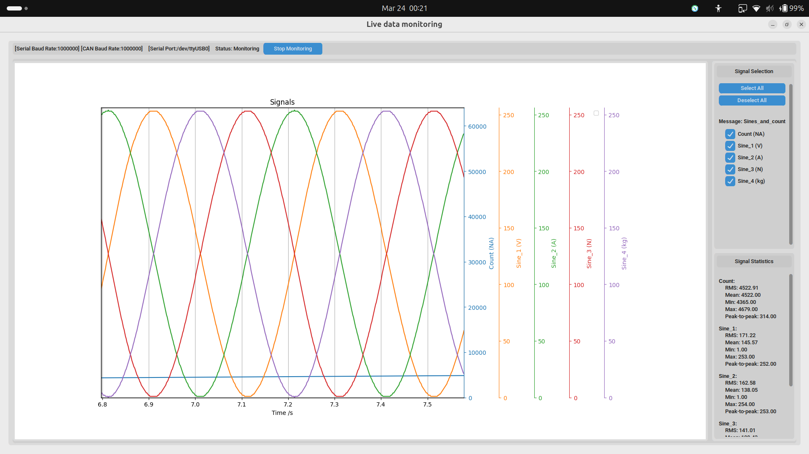

# Getting started with the software
At a high level, here is the flow of using our software:
1.  Connect the data source to your computer.
1.  Load the specification file and provide other details
1.  Start monitoring
1.  End monitoring and stop

## Detailed steps
1.  Download the CAN-DAQ application for your operating system, and double-click the icon to open it. On Windows, you may see a warning about the software being from an unknown publisher. Click on `More info` and then `Run anyway` to proceed.

1.  Choose whether you want to do monitoring right now, or explore the data recorded in a previous session by exporting it to a CSV file.

    

    If you want to do monitoring right now, choose to create a session. You will be prompted to give a name to the session. This name, along with the current date and time, will be used to create a database file in the `sessions` directory of this app. Usually, the full path to this folder will be your home folder (i.e. `/home/username/.protocol-data-monitor/sessions` on Linux/macOS, `C:\Users\username\.protocol-data-monitor\sessions` on Windows).

    

    If you instead want to explore a previous session, choose to load a session. You will be shown a list of all sessions that have been created. You can narrow this list down either by searching the name of the session or by selecting a date from the date picker. Once you have selected a session, simply click the `Export Selected` button. You can export as many sessions as you like and then exit the application.

    

1.  Connect the data source to your computer.

1.  Load the specification file and provide other details
    1.  From the `Select Device` dropdown, choose the device you are using.
    1.  From the `Select Protocol` dropdown, choose the protocol you are using.
    1.  From the `Upload Protocol File` button, find and upload the file that describes the protocol (JSON for UART, DBC for CAN). If your file was valid, you should see messages and signals from that file in the window.
    1.  Each protocol will have some properties you need to set. For example, baud rates and COM ports on your computer for UART. Set these.

    

1.  Configure the timing options if needed

    By default, the software is best configured for a data source with high sampling frequency 1kHz data source, i.e., we expect you to receive 1000 full CAN frames per second. If your data source operates at a different frequency, you may want to adjust the timing settings.

    In general, we recommend the following ranges for the values, based on timing of your data source:

    | Parameter | Meaning | Range |
    | --- | --- | --- |
    | Maximum Plot Points | Maximum number of points to plot on the graph. | 20 - 10,000 |
    | Plot update interval (ms) | Time between each update of the graph. | Suggest to keep this high: 50 ms - 1000 ms |
    | Database batch size | Number of points to write to the database at once. | We suggest logging at least every few seconds to ensure data is not lost. |
    | Statistics batch size | Number of points to use for calculating statistics (RMS, mean, etc.). | We suggest going no faster than half your signal frequency. |

    Click the "Advanced Timing Options" for this, and make sure to save your changes.

    

1.  Click the `Continue` button to continue to the graph view.

    
1.  Start monitoring
    1.  Once the graph view opens, you will see a list of messages and signals on the left. Check the boxes for the signals you want to see on the graph.
    1.  Click on `Start Monitoring` to begin monitoring the data.

        Note that you can pause and resume monitoring at any time. While you are not monitoring, we neither receive, display, nor store any data.

    

1.  Once you are finished, you **must click on `Stop Monitoring`** to make sure that the data is saved correctly. After stopping, you can close the software.

# How data should be formatted for the CAN interface
In the interest of not repeating information, please see the README of the ESP32 firmware for the CAN interface.

[can-daq-idf/README.md](/can-daq-idf/README.md)

